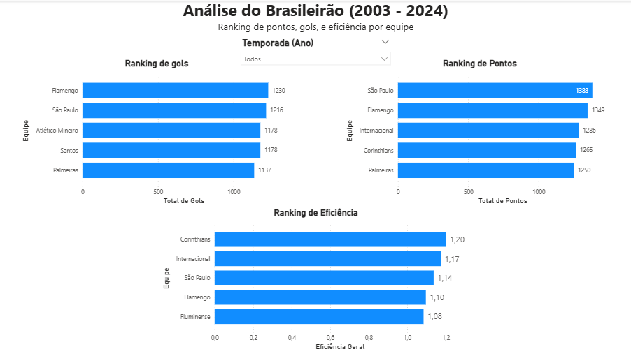
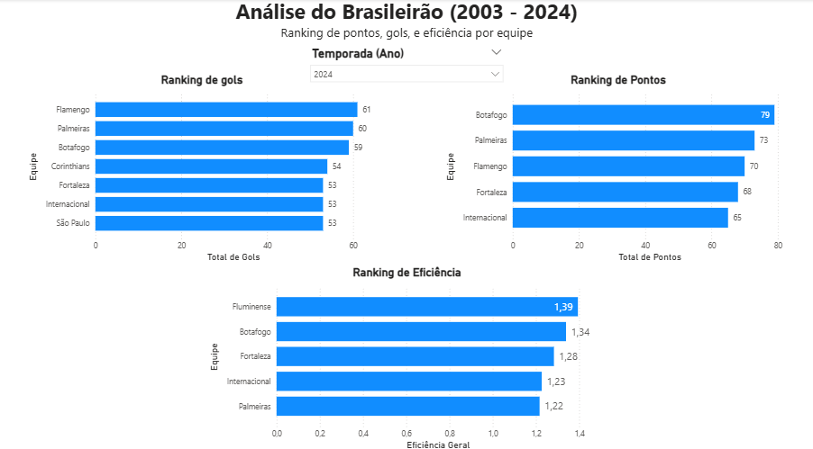

# Análise do Brasileirão (2003–2024)

Dashboard analítico desenvolvido em **Power BI** com dados históricos do Campeonato Brasileiro entre 2003 e 2024, com foco na comparação de desempenho das equipes por meio de métricas de **pontos**, **gols** e **eficiência**.

## Visão geral

Este projeto foi desenvolvido como prática de análise de dados, com o objetivo de transformar uma base histórica do Brasileirão em um painel visual e interativo. O dashboard permite comparar equipes ao longo do tempo e aplicar filtro por temporada para observar mudanças no desempenho.

## Preview do dashboard



## Preview com filtro aplicado



## Objetivos do projeto

- organizar e tratar uma base de dados esportiva
- construir visualizações comparativas no Power BI
- aplicar medidas em DAX para cálculos dinâmicos
- praticar análise exploratória e interpretação de métricas

## Ferramentas utilizadas

- **Excel**  
- **Power BI**  
- **Power Query**  
- **DAX**

## Métricas analisadas

O dashboard foi estruturado com base em três indicadores principais:

- **Total de Pontos**
- **Total de Gols**
- **Eficiência Geral**

A eficiência foi calculada com DAX da seguinte forma:

```DAX
Eficiência Geral = DIVIDE(SUM(brasileirao[Pontos]), SUM(brasileirao[Gols]))
Total de Pontos = SUM(brasileirao[Pontos])
Total de Gols = SUM(brasileirao[Gols])
```
## Funcionalidades do dashboard

O painel permite:

* Visualizar o ranking de equipes por pontos
* Visualizar o ranking de equipes por gols marcados
* Comparar a eficiência das equipes
* Filtrar os resultados por temporada
* Analisar o desempenho histórico acumulado entre 2003 e 2024

## Principais insights observados

Com a visão histórica completa, foi possível identificar alguns padrões interessantes:

* O **São Paulo** aparece com destaque no ranking de pontos, indicando grande constância ao longo do período analisado
* O **Flamengo** se destaca em gols marcados, mostrando forte volume ofensivo
* Equipes como **Corinthians**, **Internacional** e **São Paulo** apresentam boa relação entre pontos e gols, sugerindo maior eficiência competitiva

````md
## Estrutura do repositório

```text
dashboard-brasileirao-powerbi/
├── README.md
├── dashboard/
│   └── Analise_Brasileirao.pbix
├── data/
│   └── brasileirao.xlsx
└── images/
    └── dashboard-geral.png
````

## Como visualizar

1. Baixe o arquivo `.pbix`
2. Abra no **Power BI Desktop**
3. Utilize o filtro de temporada para explorar os dados
4. Compare os rankings e métricas entre as equipes

## Aprendizados com o projeto

Durante o desenvolvimento deste projeto, foram praticados conceitos importantes de análise de dados, como:

* Limpeza e organização de dados
* Uso de tabelas dinâmicas no Excel
* Construção de visualizações analíticas
* Correção de inconsistências na base
* Uso de segmentação de dados
* Criação de medidas em DAX
* Estruturação de dashboard interativo

## Sobre o projeto

Este projeto foi desenvolvido com fins de estudo e portfólio, como parte do processo de aprendizado em **análise de dados** aplicada ao contexto esportivo.

## Autor

Desenvolvido por **[João Vitor](https://github.com/rulff04)**

